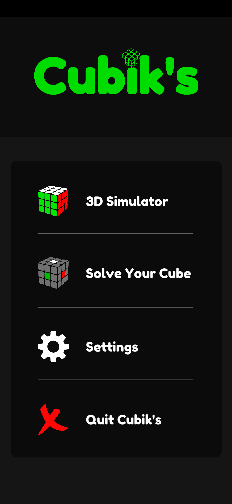
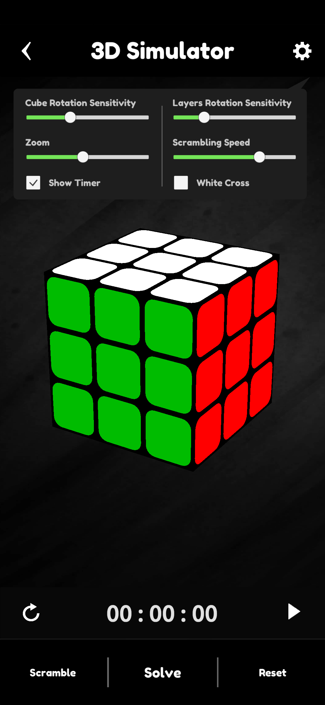
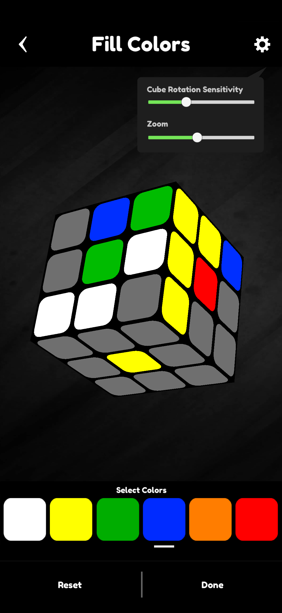
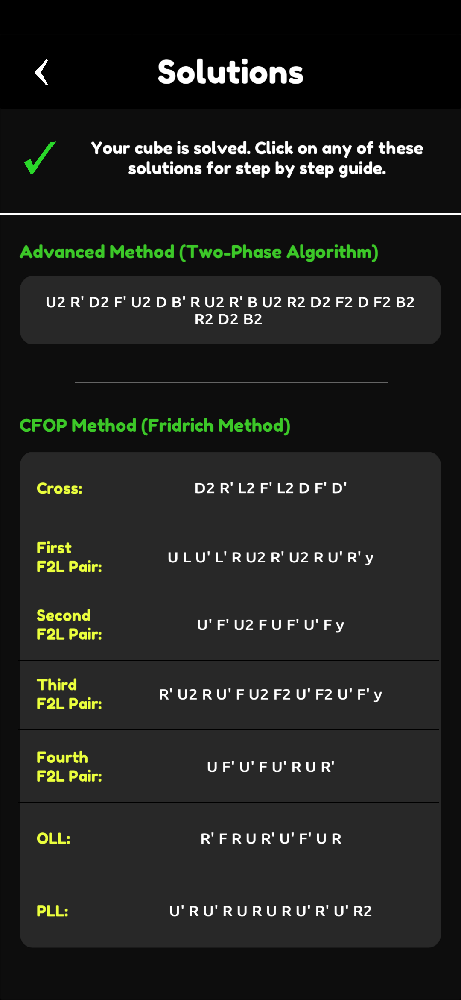
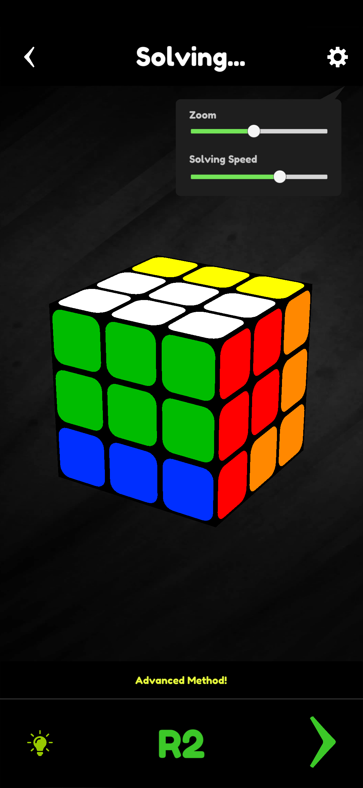
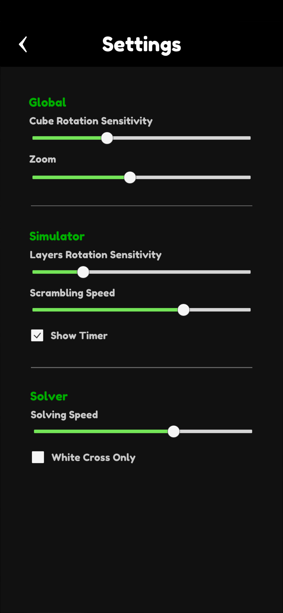

# Cubik's
### Cubik's is a 3 x 3 x 3 Rubik's cube simulator and solver for android.   
User can play with 3D model of rubik's cube and solve their own cube by filling the colors as well. The app solved any scrambled cube under a second using two methods, **CFOP(Fridrich)** and **Kociemba's two-phase method.** 
* CFOP method is used by most of the speedcuber. It's a layer by layer method having 4 main steps - Cross, F2L, OLL, PLL. Average length of this solution is 70 moves. 
* Two-phase method is developed by Herbert Kociemba. Average length of this solution is 21 moves. 
The app also guides the user to the solution step by step by performing every step is simulator. App has other useful settings as well. (Screenshots below).  

               
